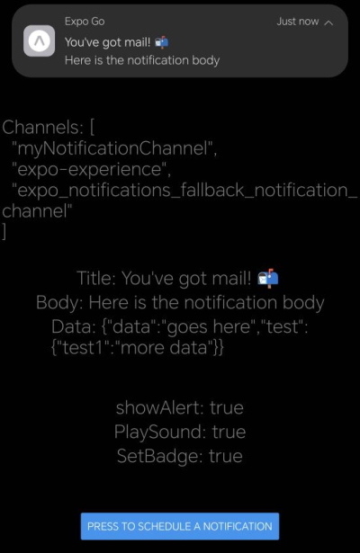

<p align="center">
    
</p>

<div align="center">

# Simplest Notification using React Native with Expo.

[](https://expo.dev/)


</div>

<p align="center">
  The simplest way to implement notifications when using React Native with Expo.
</p>

## About the project

This is just a simple project to show the fastest and easiest way to send notifications in cellphones.

## TODO

- [X] Read official docs for notification info.
- [X] Fix official docs code bugs.
- [X] add notification info in screen.
- [X] Fix colors when using dark mode.

- [ ] Add cancel notifications feature.
- [ ] Add clear all notifications feature.


## How to install

Clone the repo.

```bash
   git clone https://github.com/Marfullsen/simplest-notification-react-native.git
```
Go to the folder.

```bash
   cd simplest-notification-react-native/
```

Install dependencies

```bash
   npm install
```

 and run using NPX command.

```bash
   npx expo start
```

## How did I created this project?

I followed and fixed the official docs code to understand basics of notifications.

[Expo Notifications](https://docs.expo.dev/versions/latest/sdk/notifications/)

Be careful bcs expo-notifications will be unavailable in future SDKs.

> [!WARNING]
> __Push notifications (remote notifications) functionality provided by expo-notifications will be unavailable in Expo Go from SDK 53. A development build will be required to use push notifications. Local notifications (in-app notifications) will remain available in Expo Go.__

### Create a new app.

I used this command to create a new expo project.

```bash
   npx create-expo-app@latest simplest-nofitication-react-native
```

install the libraries needed.

```bash
    npx expo install expo-notifications
    npx expo install expo-device
```

paste the code from official docs [Expo Notifications](https://docs.expo.dev/versions/latest/sdk/notifications/).

Repair the broken lines.

> [!IMPORTANT]
> Missing Import for SchedulableTriggerInputTypes: The SchedulableTriggerInputTypes is not imported, which will lead to a reference error when you try to use it in the schedulePushNotification function.

```js
import { SchedulableTriggerInputTypes } from 'expo-notifications'; // Import the missing type
```

Run the project using this command.

```bash
    npx expo start
```

## Screenshots

<p align="center">
    
</p>

When pressed, in development console you'll receive this message.

```
 (NOBRIDGE) LOG  {"actionIdentifier": "expo.modules.notifications.actions.DEFAULT", "notification": {"date": 1735692275269, "request": {"content": [Object], "identifier": "000000aa-0aa0-00aa-0000-0a000000a000", "trigger": [Object]}}}
```

## References

- [Icon by Roundicons Premium](https://www.freepik.com/icon/message_14048390#fromView=search&page=1&position=13&uuid=ba608261-3134-49a2-a667-b549834b04e8)

- [Expo Notifications](https://docs.expo.dev/versions/latest/sdk/notifications/ "Expo Notifications") - A library that provides an API to fetch push notification tokens and to present, schedule, receive and respond to notifications.
